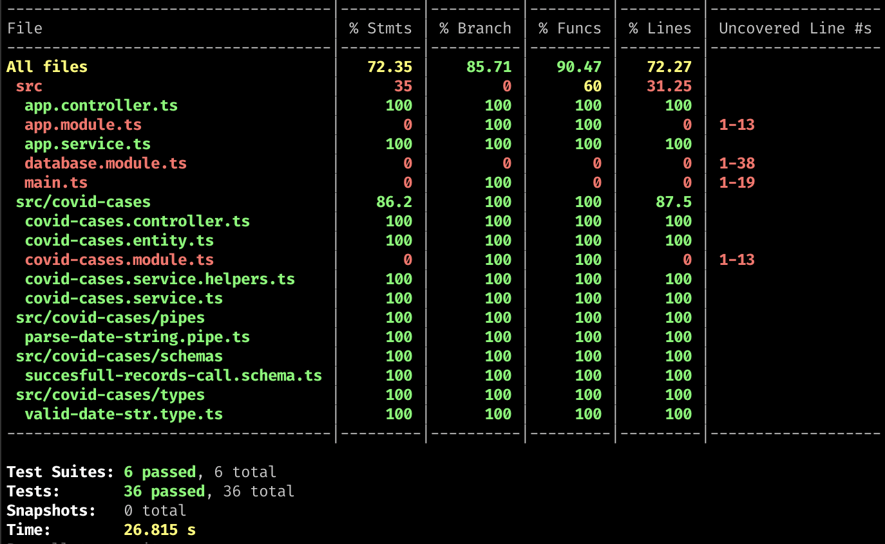

# Covid Cases app

<p align="center">
  <a href="http://nestjs.com/" target="blank"></a>
</p>

[circleci-image]: https://img.shields.io/circleci/build/github/nestjs/nest/master?token=abc123def456
[circleci-url]: https://circleci.com/gh/nestjs/nest

<p align="center">Built with Nest.js</p>
  <p align="center">A progressive <a href="http://nodejs.org" target="_blank">Node.js</a> framework for building efficient and scalable server-side applications.</p>
    <p align="center">

## API docs
Swagger: [https://app.swaggerhub.com/apis/gabrielcipriano/covid-cases-api/1.0](https://app.swaggerhub.com/apis/gabrielcipriano/covid-cases-api/1.0)

## Video de apresentação
[https://www.loom.com/share/9617a3636f1a493c8fc2860f2baf8b49](https://www.loom.com/share/9617a3636f1a493c8fc2860f2baf8b49)
  
## Installation

```bash
$ npm install
```
## .env configuration file
### Config your DB conection copying the .env.example file 
```bash
# copy
$ cp .env.example .env
```
## [important] Running migrations (creates tables and seeds data from csv file)

```bash
# running migrations
$ npm run typeorm migrations:run
```

## Running the app (port 3000)

```bash
# development
$ npm run start

# watch mode
$ npm run start:dev

# production mode
$ npm run start:prod
```

## Test

```bash
# unit tests
$ npm run test

# e2e tests
$ npm run test:e2e

# test coverage
$ npm run test:cov
```

##  Dockerizing your application

```bash
# build image
$ docker build -t covid_cases_api .
# Make sure the docker entrypoint can be executed
$ chmod 777 docker-entrypoint.sh
# Config the .env.docker file, if needed
$ nano .env.docker
# instantiate a container
$ docker run -p 3000:3000 -d \
  --name covid_cases_api_0 \
  --add-host=host.docker.internal:host-gateway
  --restart always \
  covid_cases_api
# If it fails, you can try host network: (insecure - devmode only)
$  docker run -d \
  --name covid_cases_api_0 \
  --network="host"
  --restart always 
  covid_cases_api
```

## Test coverage


## License

[MIT licensed](LICENSE).

### This is a challenge by [Coodesh](https://coodesh.com)
